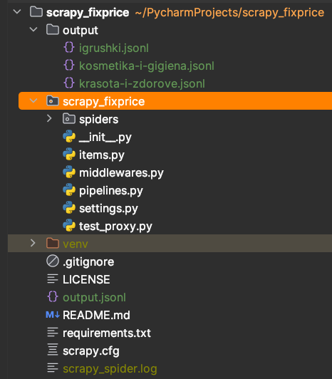
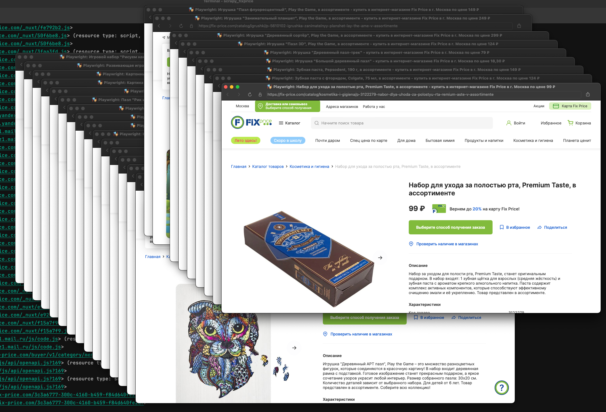
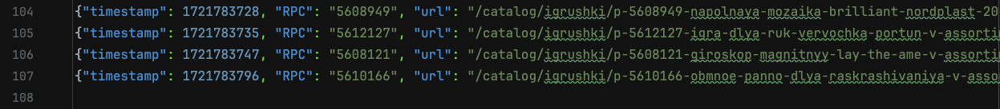
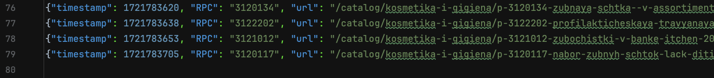
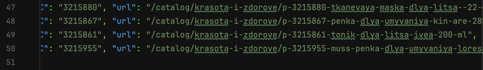

# scrapy_fixprice
fix-price.com goods parser

Полного соответствия ТЗ нет. Реализован основной движок.
Парсер обкачивает заданные категории для сбора данных по шаблону из ТЗ.
Результаты записываются в общий файл и сортируются по категориям.
Для 100% соответствия нужна тонкая настройка таргетирования элементов DOM.

Реализована подмена UserAgents rotation. Использую stealth_async.
Тестируется отмена загрузки изображений, блокировка трекеров и диалогов.

Были успешно интегрированы rotating proxies from WEBSHARE.io.
Но сайт запросил решение CAPTCHA. С наскока обойти не получилось.
Пока rotating proxies from WEBSHARE.io отключены.

Выбор города при старте парсера не реализован. 
На этом этапе принципиального значения не имеет.

Код не является готовым решением - это рабочий вариант.
Ожидает декомпозиции и тестирования после достижения результата.

Проект:

Парсинг с пагинацией:

Игрушки:

Косметика:

Красота и здоровье:

